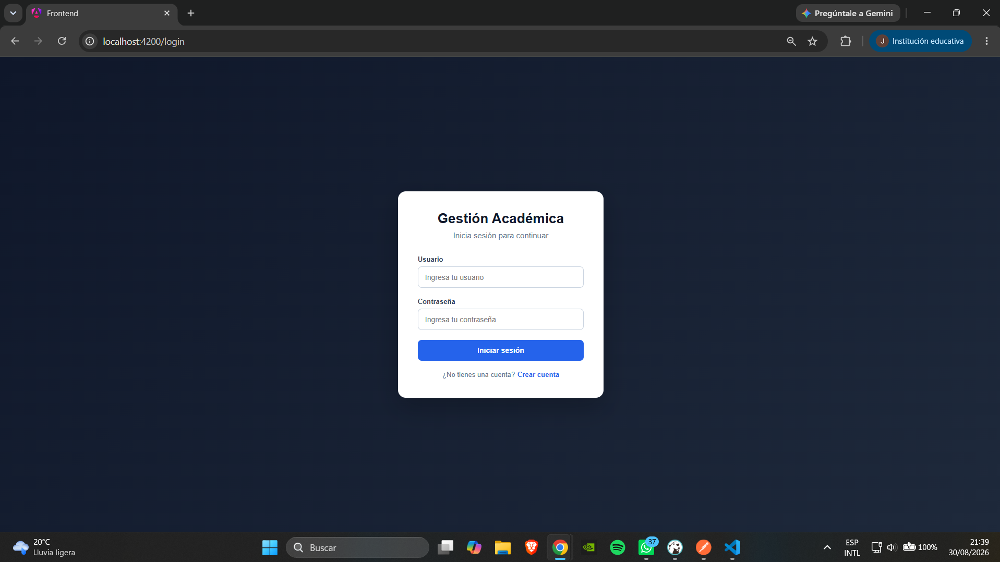
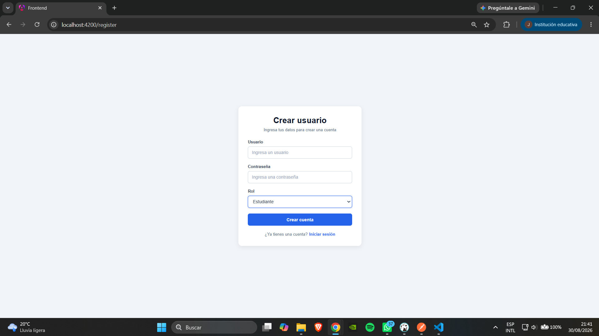
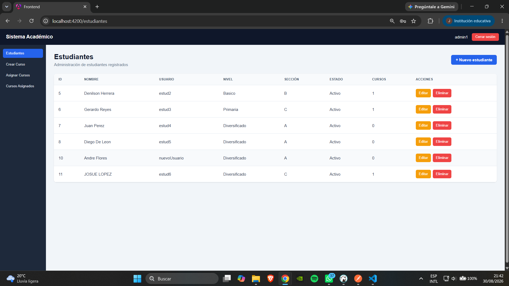
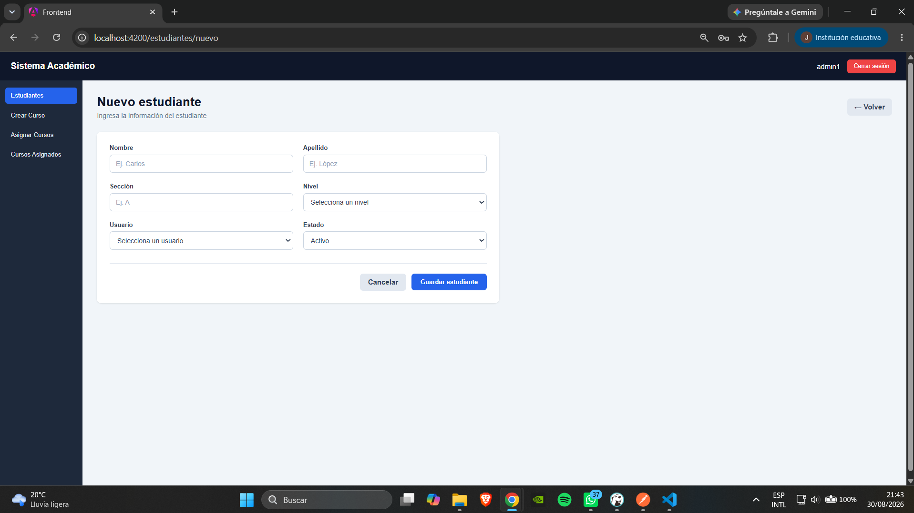
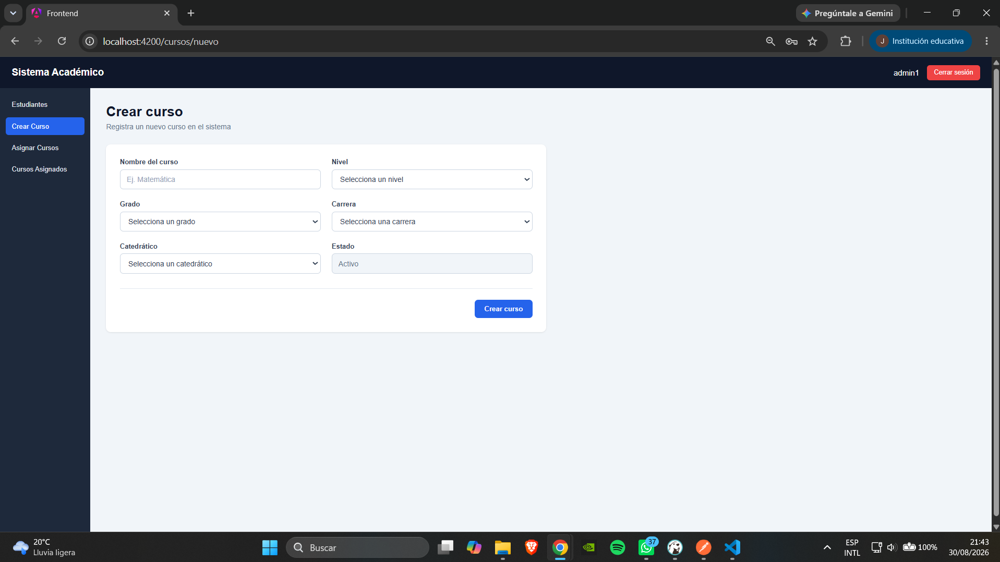
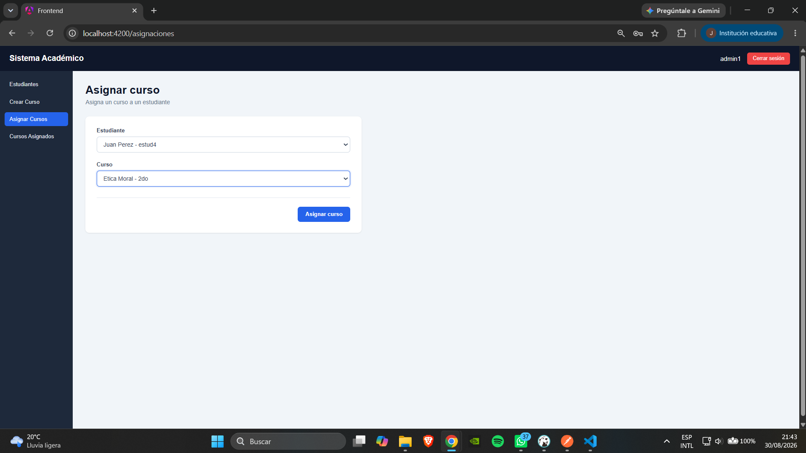
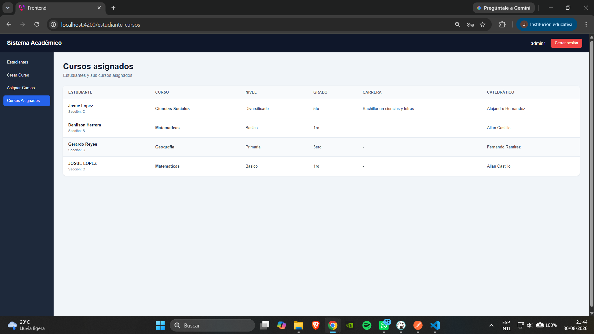
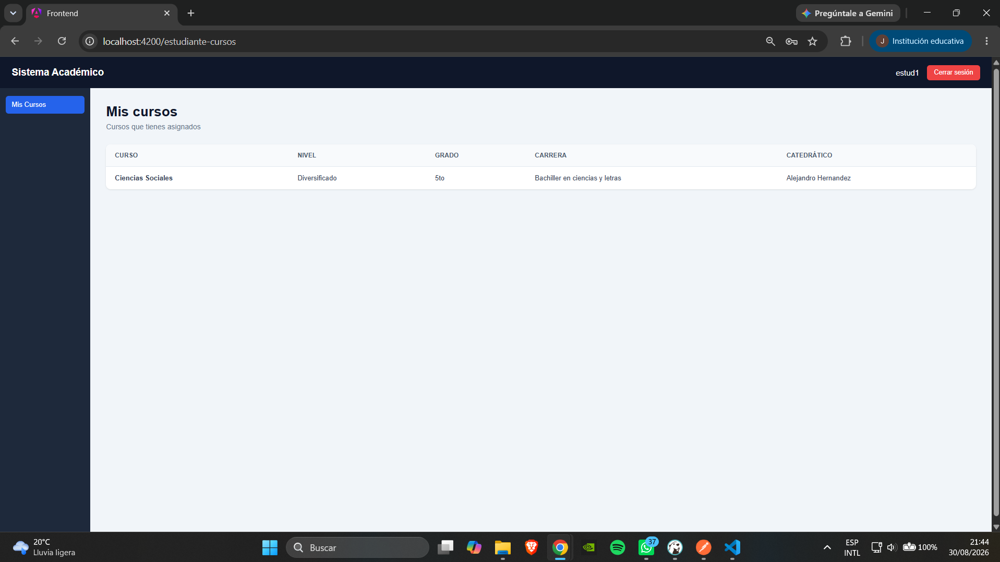

# CRUD Estudiantes - Frontend

Aplicación web desarrollada con **Angular** para la gestión académica de estudiantes y cursos.

El sistema permite la autenticación de usuarios mediante roles, la administración de estudiantes, creación de cursos, asignación de cursos y visualización de los cursos asignados.

---

## Tecnologías utilizadas

- Angular
- TypeScript
- HTML
- SCSS
- Angular Router
- HttpClient
- JWT
- pnpm

---

## Requisitos previos

Antes de ejecutar el frontend es necesario tener instalado:

- Node.js
- pnpm
- Git

También es necesario tener el **backend desarrollado con NestJS en ejecución**, ya que el frontend consume la API REST proporcionada por este.

Para verificar que Node.js y pnpm estén instalados:

```bash
node -v
pnpm -v
```

---

## Instalación

### 1. Clonar el repositorio

```bash
git clone https://github.com/iJosxh/CRUD-Estudiantes-Frontend.git
```

### 2. Ingresar al proyecto

```bash
cd CRUD-Estudiantes-Frontend
```

### 3. Instalar las dependencias

```bash
pnpm install
```

---

## Configuración del Backend

El frontend consume una API REST desarrollada con **NestJS**.

La configuración de la URL del backend se encuentra en:

```text
src/environments/environment.ts
```

La configuración utilizada para desarrollo es:

```ts
export const environment = {
  production: false,
  apiUrl: 'http://localhost:3000'
};
```

Por lo tanto, antes de iniciar el frontend se debe verificar que el backend esté ejecutándose en:

```text
http://localhost:3000
```

---

## Ejecución del Frontend

Para iniciar la aplicación ejecutar:

```bash
cd frontend
```

Luego:

```bash
pnpm start
```

Una vez iniciado el servidor de desarrollo, ingresar desde el navegador a:

```text
http://localhost:4200
```

---

# Evidencia visual

A continuación se presentan capturas de pantalla del funcionamiento de la aplicación.

---

## Sign In

Pantalla de inicio de sesión donde el usuario ingresa sus credenciales para acceder al sistema.



---

## Sign Up

Pantalla para la creación de una nueva cuenta de usuario.



---

## Administrador - Listado de Estudiantes

El administrador puede visualizar los estudiantes registrados en el sistema junto con su información.



---

## Administrador - Crear Estudiante

Formulario utilizado por el administrador para registrar la información de un estudiante.



---

## Administrador - Crear Curso

El administrador puede registrar nuevos cursos indicando la información correspondiente.



---

## Administrador - Asignar Curso

Pantalla utilizada para seleccionar un estudiante y asignarle un curso.



---

## Administrador - Cursos Asignados

El administrador puede consultar las asignaciones de cursos realizadas a los estudiantes.



---

## Estudiante - Cursos Asignados

El usuario con rol Estudiante puede consultar únicamente los cursos que tiene asignados.



---

## Estructura principal

El proyecto utiliza una estructura organizada por funcionalidades.

```text
src/
├── app/
│   ├── core/
│   │   ├── guards/
│   │   ├── interceptors/
│   │   └── services/
│   │
│   ├── features/
│   │   ├── auth/
│   │   ├── estudiantes/
│   │   ├── cursos/
│   │   └── asignaciones/
│   │
│   └── layout/
│
├── docs/
│   ├── Admin-AsignarCurso.png
│   ├── Admin-CrearCurso.png
│   ├── Admin-CrearEstudiante.png
│   ├── Admin-CursosAsignados.png
│   ├── Admin-ListadoDeEstudiantes.png
│   ├── Estudiante-CursosAsignados.png
│   ├── Sign-In.png
│   └── Sign-Up.png
│
└── environments/
```

---

## Consideraciones para la ejecución

Para utilizar correctamente la aplicación se debe ejecutar primero el **backend NestJS** y posteriormente el **frontend Angular**.

El orden recomendado es:

```text
1. Iniciar SQL Server
2. Iniciar Backend NestJS
3. Iniciar Frontend Angular
4. Abrir http://localhost:4200
```

---

## Autor

```text
https://github.com/iJosxh
```